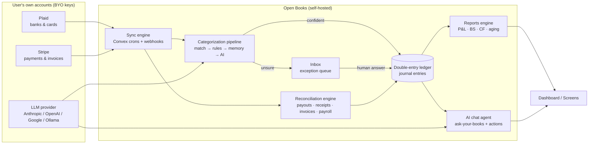

# Open Books — Product & Technical Specification (v1)

Stack: **Next.js (App Router) + Convex (self-hosted, Docker) + Vercel AI SDK (v6) + shadcn/ui + Tailwind**. License: AGPL-3.0. Deploy: single `docker compose up` (app + Convex backend + Convex dashboard).

---

## 1. System Overview



**The core loop:** money moves → transaction syncs in → pipeline categorizes it → ledger posts it → dashboard updates. Exceptions go to the Inbox. The human's only job is answering inbox questions; everything else is optional.

---

## 2. The Hidden Double-Entry Ledger (concept)

This is the most important architectural decision. Users see **transactions with categories**. The system stores **journal entries with balanced lines**.

- Every user-visible event (a categorized bank transaction, an invoice payment, a payroll run, a Stripe payout) compiles into a `journalEntry` with ≥2 `journalLines` where **Σ debits = Σ credits** — enforced by a single `postEntry` mutation (Convex mutations are ACID/serializable, so the books can never half-post).
- **Immutability:** posted entries are never edited. Re-categorizing creates a reversing entry + a new entry, linked for audit. This gives a bulletproof audit trail and makes "AI did something wrong" always recoverable.
- "Categories" in the UI **are** ledger accounts. Picking "Software & SaaS" on a $50 charge posts: debit `Expense:Software` 50 / credit `Assets:Bank:Chase Checking` 50. The user never sees those words.
- The **accountant drawer** (Settings → Accounting) exposes the raw layer: chart of accounts, manual journal entries, general ledger, trial balance, period close.

### Seeded Chart of Accounts (~30, per entity)

- **Assets (1xxx):** Bank accounts (one per connected/manual account, auto-created) · Stripe Clearing (one per Stripe account) · Accounts Receivable · Prepaid Expenses · Equipment
- **Liabilities (2xxx):** Credit cards (auto-created per connection) · Accounts Payable · Payroll Payable · Loans
- **Equity (3xxx):** Owner's Equity · Owner's Draw · Retained Earnings · Opening Balance
- **Income (4xxx):** Sales · Services · Other Income (user adds their real income streams during onboarding; AI suggests from Stripe products)
- **Expenses (5xxx–6xxx):** Payroll & Contractors · Rent · Software & SaaS · Cloud/Infrastructure · Marketing & Ads · Professional Services · Payment Processing Fees · Insurance · Meals · Travel · Office & Supplies · Utilities · Bank Fees · Taxes & Licenses · Other
- **System (non-deletable):** Uncategorized Income · Uncategorized Expense · Opening Balance Equity

Onboarding asks "what kind of business?" (services / software / e-commerce / agency) and seeds an adjusted set. Users can add/rename/archive; account `type` + `subtype` metadata drives all reports.

---

## 3. Connections & Sync

### 3.1 Plaid (banks & credit cards)
- Settings → Connections → "Connect a bank": user pastes their **own** `client_id` + `secret` once (stored encrypted in Convex env/table); Plaid Link launches; each bank = one Item; user selects which accounts to include (per his requirement: list all, choose subset).
- Each included account auto-creates a ledger account (type bank or credit card).
- **Sync:** `/transactions/sync` cursor-based; Convex cron every 4h per Item + manual "Sync now" + optional `SYNC_UPDATES_AVAILABLE` webhook via Convex HTTP action. Initial pull: up to 24 months history (user choice: 3/12/24 mo).
- **Critical edge:** pending→posted = Plaid *removes* the pending txn ID and *adds* a new one. Handle the `removed` array; carry over category/receipt links via amount+date+merchant heuristic match.
- Item errors (`ITEM_LOGIN_REQUIRED`) → Inbox card → re-auth via Link update mode.
- Capture Plaid's `personal_finance_category` + `confidence_level` as a categorization prior.
- **Fallbacks (same internal interface):** CSV/OFX import wizard (always available, AI maps columns), SimpleFIN Bridge adapter ($15/yr, US), Teller adapter. Build a `BankProvider` abstraction from day one (Midday's proven pattern).

### 3.2 Stripe (income, customers, invoices, payouts)
- Settings → Connections → "Connect Stripe": user pastes a **restricted, read-mostly key** (read: charges, balance transactions, payouts, customers, invoices; write: invoices + customers only, for the invoicing feature). Multiple Stripe accounts supported (N keys), each mapped to an entity + its own Stripe Clearing account.
- **Sync (cron every 4h + manual + optional webhooks):** customers → directory; charges/payment intents → income transactions (who paid what — income attribution); invoices → AR; payouts → reconciliation engine.

### 3.3 AI provider (BYO model)
- Settings → AI: pick provider (Anthropic / OpenAI / Google / Ollama / any OpenAI-compatible URL), paste key, pick model for chat vs. categorization (can differ — cheap model for categorization, smart model for chat), optional embeddings model.
- Implemented with AI SDK provider registry + `createOpenAICompatible`; config persisted in Convex, instantiated at runtime. **No key = degraded mode:** rules + Plaid categories + manual still work (AI is an enhancer, not a dependency).
- **Autonomy dial** (global): `Suggest everything` (AI never posts, all to Inbox) / `Balanced` (default: auto-post ≥90% confidence) / `Autopilot` (auto-post ≥75%, weekly digest instead of per-item inbox). **Canonical threshold mapping (single source of truth):** `suggest → never auto-post`, `balanced → 0.90`, `autopilot → 0.75` — implemented as a constant; the `aiConfig.autonomy` enum resolves to these values.

---

## 4. The Categorization Pipeline (the heart)

Every incoming transaction runs this cascade — cheapest signal first, LLM last:

1. **Dedupe/transfer check** — same amount, opposite sign, ±3 days across two connected accounts → propose Transfer (posts between two asset accounts, no P&L impact). Stripe payout deposits are intercepted here too (§5).
2. **Record match** — does an open invoice, bill, payroll run, or expected payout match on amount±tolerance and date±7d? → propose Match (clears AR/AP rather than creating new income/expense).
3. **User rules** — ordered rule list; conditions on merchant/description/bank text (contains / exact / regex), amount (=, >, <, range), direction, account; OR-groups supported (improvement over QBO); actions: set category, payee, entity, split %, auto-post or flag. First match wins.
4. **Memory (embeddings)** — embed `merchant + description`; Convex vector search over previously categorized transactions; if top match similarity ≥ threshold and consistent history → adopt its category with high confidence. This is how the system learns without retraining.
5. **Plaid prior** — `personal_finance_category` mapped to our CoA as a weak prior.
6. **LLM** — AI SDK structured output: input = transaction + candidate categories + top-5 similar past transactions + business context (entity type, vendor list); output = `{ categoryId, confidence (0–1), reasoning, newVendorName?, isPersonal?, needsHuman?, question? }`. Batched (up to ~20 txns/call) to cut cost/latency.
7. **Routing** — confidence ≥ autonomy threshold → auto-post (logged with reasoning + which pipeline stage decided). Below → **Inbox** card with AI's best guess pre-selected, its reasoning, and one-tap confirm/correct. Corrections write back to memory (embedding) and prompt "make this a rule?" — and after 3 identical corrections, AI proactively drafts the rule.

---

## 5. Reconciliation Engines

### 5.1 Stripe payout reconciliation (signature feature)
The problem: Stripe deposits one net lump ("$1,940") covering many charges minus fees. Naïve tools book that as revenue — wrong gross revenue, invisible fees, no idea who paid.

The **clearing account method**, fully automated:
1. Charge succeeds → post: debit `Stripe Clearing` $500 / credit `Income:Sales` $500 (gross, attributed to the Stripe customer).
2. Fee → debit `Expense:Payment Processing Fees` $15 / credit `Stripe Clearing` $15. (Refunds/disputes post similarly, reversed.)
3. Payout lands → fetch `GET /balance_transactions?payout=po_xxx&expand[]=data.source`, verify Σnet = payout amount → post: debit `Assets:Bank` $1,940 / credit `Stripe Clearing` $1,940 — and **auto-match** the incoming Plaid bank transaction to this entry (so the bank feed deposit is consumed, not double-counted).
4. Invariant: clearing balance returns to $0 each cycle. Drift ≠ 0 → Inbox card "Stripe payout doesn't add up" with the diff itemized.

Result: gross revenue by customer, fees as their own expense line, deposits reconciled — automatically. UI shows a payout drill-down: deposit → charges list → fees.

### 5.2 Receipt & document matching
- In: drag-drop/upload, or forward to a per-workspace email alias.
- AI extraction (vision/LLM): vendor, date, total, currency, line items → stored on the document.
- Embedding + heuristic match against transactions (amount delta, date proximity, merchant similarity — Midday's proven 95%+ pattern): high → auto-attach; medium → Inbox "Does this receipt match this transaction?"; none → Pending; if no transaction exists (paid cash / personal card) → offer to create a manual expense or a Bill.

### 5.3 Invoice (AR) and Bill (AP) settlement
- Stripe invoice paid → Stripe events settle it; AR cleared via payout flow automatically.
- Manually-recorded invoice payments and bill payments are matched against bank feed transactions in pipeline stage 2; confirming a match posts the settlement entry (clears AR/AP).

### 5.4 Statement reconciliation (lightweight, monthly)
Per bank account: "ending balance per ledger vs. bank balance per Plaid" tile; mismatch → guided diff (uncleared/excluded/missing transactions). No ritual check-the-statement workflow in v1 — bank feeds make it mostly self-reconciling; full statement-based reconcile is v2.

---

## 6. Modules (functional spec)

### 6.1 Inbox
One queue, six card types: **categorize** (confirm/correct AI guess) · **receipt match** · **possible transfer/duplicate** · **payout mismatch** · **connection issue** (re-auth) · **AI question** (free-form, e.g. "Three payments to 'J. Doe' look like payroll — is this a new employee?"). Each card: context, AI reasoning, one-tap primary action, batch select, keyboard-first (J/K/E/A). Empty state = "Inbox zero — your books are up to date" + automation-rate stat. Weekly digest email/summary optional.

### 6.2 Transactions
Unified register across all accounts: filters (entity, account, category, contact, status: reviewed/unreviewed/excluded, date), search (full-text + "ask AI to filter"), inline category edit, split editor, bulk actions, exclude (with reason: personal/duplicate), manual transaction add, CSV export. Row affordances: source icon (bank/Stripe/manual), receipt-attached chip, AI-categorized badge with reasoning popover, posted-entry drawer (the debit/credit view, for the curious).

### 6.3 Invoices (AR)
List with status pipeline (Draft → Open → Paid / Overdue / Void) + AR aging mini-bars. Composer: customer (from directory, synced to Stripe), line items (products/services list, prices), terms/due date, memo → creates Stripe invoice via API → Stripe hosts payment page + sends email. Receivables view: open balance by customer, aging buckets (0–30/31–60/61–90/90+), overdue flags. Recurring invoices: v1.5 (template + cron).

### 6.4 Bills (AP)
Add bill: manual form or upload PDF → AI extracts vendor/amount/due date → confirm. List by due date with aging buckets; "mark as paid" links to the matching bank transaction (or schedules expected match). Posts: bill entry (debit expense / credit AP) on entry, settlement (debit AP / credit bank) on payment — giving true accrual AP without the user knowing what accrual means.

### 6.5 Customers & Vendors (Contacts)
One directory, role-tagged (customer/vendor/employee-adjacent). Auto-created from Stripe customers and from AI vendor-normalization of bank merchants ("AMZN MKTP US*2X4" → "Amazon"). Profile: totals, open AR/AP, transaction history, default category (acts as an implicit rule).

### 6.6 Payroll Register (custom, lightweight)
- **Employees:** name, role, country, currency (USD/PKR/INR/…), monthly salary in local currency, payment method note, active/inactive. Staff role can maintain this list.
- **Payroll runs:** create run for a month → grid of employees with editable amounts (bonuses/deductions per line) → totals per currency + converted to entity base currency at run-date FX rate (manual rate or fetched) → mark "paid" per line or whole run.
- **Posting:** run total posts debit `Expense:Payroll & Contractors` / credit `Payroll Payable`; each outgoing bank transaction that matches a line settles it (debit `Payroll Payable` / credit bank). FX difference on settlement posts to a small FX gain/loss line automatically.
- **Statement view:** monthly payroll statement — by employee, by country/currency, base-currency total, history trend. Exportable PDF/CSV.
- Explicitly out: tax filing, payslips, payment initiation (v2 may add payment-file generation).

### 6.7 Reports
All reports = queries over journal lines grouped by account type/subtype; any custom date range + presets; monthly/quarterly comparison columns; **cash vs. accrual toggle** (accrual = all entries; cash = exclude unsettled AR/AP entries); drill-down from any number to its transactions; export CSV/PDF; "Explain this report" AI button (plain-English narrative of what changed and why).
1. **Profit & Loss** (the daily driver) — income by category, expenses by category, net profit; by-month columns; % of income.
2. **Balance Sheet** — assets/liabilities/equity as of date; current period net income rolls into equity.
3. **Cash Flow Statement** — v1: direct-method style from cash-account movements grouped operating/investing/financing (simpler and more meaningful for SMBs); indirect method later.
4. **AR Aging** & **5. AP Aging** — buckets by contact.
6. **Expenses** — by category & by vendor, trend, MoM deltas.
7. **Income by Customer** — concentration view (top customers, % of revenue).
8. **Payroll Summary** — by month/employee/currency.
9. **General Ledger**, **10. Trial Balance**, **11. Journal Entries view** (accountant drawer: browseable entry-centric register) + GL/journal export.
12. **Monthly Review** — the founder's one-page month: income & who paid (top customers), money owed to you (open AR), money you owe (open bills), expenses by category, payroll total — for any selected month, printable/shareable. Composed from the same queries as the reports above; this is the "go in and see my month" requirement as a single screen.

### 6.8 AI Chat (sidebar)
Collapsible right panel (also expandable to a full page), streaming (`useChat`). Read tools: `queryTransactions`, `getReport(P&L/BS/CF/aging, range)`, `getBalances`, `searchContacts`, `getPayrollRuns`. Action tools (always propose → user confirms in-chat): `categorizeTransactions`, `createRule`, `draftInvoice`, `addBill`, `createJournalEntry`. Context: entity, date, CoA summary. Sample prompts surfaced: "How did we do last month vs. before?" · "Top 5 expenses this quarter?" · "Who owes me money right now?" · "How much did Stripe take in fees this year?" · "What's my monthly payroll cost in USD?"

### 6.9 Multi-entity
Workspace → N entities. Each entity: own CoA, connections, base currency, books, reports. Entity switcher in the top bar; "All entities" mode on dashboard for cash position + combined feed only (consolidated reporting is v2). Connections/accounts are assigned to exactly one entity; rules can route ("transactions on account X → entity Y").

### 6.10 Settings
Workspace & entities · Connections (banks/Stripe/import) · AI (provider, models, keys, autonomy, monthly AI-spend meter) · Categories (CoA editor, friendly mode + accountant mode) · Rules manager (ordered list, hit counts, AI-suggested rules pending approval) · Team (Owner / Staff: transactions+payroll+bills, no settings / Accountant: read-all + journal entries) · Data (export all: CSV per table + GL export + JSON dump; import) · Audit log (every posting, who/what/why — human, rule #, or AI + reasoning) · Period close (soft-lock date, warn on backdated edits).

---

## 7. Data Model (Convex schema, condensed)

```ts
// — workspace & config —
workspaces        { name }
entities          { workspaceId, name, type, baseCurrency, fiscalYearStart }
users             { workspaceId, email, role: "owner"|"staff"|"accountant" }
connections       { entityId, kind: "plaid"|"stripe"|"csv", label, encryptedCreds,
                    status, lastSyncedAt, cursor }
aiConfig          { workspaceId, provider, chatModel, categorizeModel, embedModel,
                    encryptedKey, autonomy: "suggest"|"balanced"|"autopilot" }

// — ledger core (hidden) —
ledgerAccounts    { entityId, name, type: "asset"|"liability"|"equity"|"income"|"expense",
                    subtype, number, currency, isSystem, archived }
journalEntries    { entityId, date, memo, source: "bank"|"stripe"|"manual"|"payroll"|
                    "invoice"|"bill"|"ai"|"rule", sourceId, reversesEntryId?, postedBy, locked }
journalLines      { entryId, accountId, debit, credit, contactId?, currency, fxRate? }
// invariant enforced in postEntry mutation: Σdebit === Σcredit per entry

// — operational layer (what users see) —
bankAccounts      { entityId, connectionId, ledgerAccountId, plaidAccountId?, name,
                    mask, kind: "checking"|"savings"|"credit", balance, includeInSync }
transactions      { entityId, bankAccountId?, stripeAccountId?, date, amount, currency,
                    merchant, rawDescription, status: "pending"|"posted",
                    review: "auto"|"confirmed"|"needs_review"|"excluded",
                    categoryAccountId?, contactId?, splits?: [{accountId, amount}],
                    entryId?, transferPairId?, externalId, embedding: v.vector,
                    aiMeta?: { confidence, reasoning, decidedBy: "match"|"rule"|"memory"|"ai" } }
rules             { entityId, order, name, conditions: [...], orGroups, actions: {...},
                    autoPost, hitCount, createdBy: "user"|"ai" }
documents         { entityId, storageId, kind: "receipt"|"bill"|"statement",
                    extracted: { vendor, date, total, currency, lineItems },
                    matchedTransactionId?, status: "pending"|"matched"|"unmatched" }
inboxItems        { entityId, kind: "categorize"|"receipt"|"transfer"|"payout_mismatch"|
                    "connection"|"question", payload, status: "open"|"resolved"|"dismissed",
                    resolution?, createdAt }

// — contacts, AR/AP, payroll —
contacts          { entityId, name, roles: ["customer"|"vendor"], email?, stripeCustomerId?,
                    defaultCategoryId?, aliases: string[] }
invoices          { entityId, contactId, stripeInvoiceId?, number, status, currency,
                    lineItems, issueDate, dueDate, total, amountPaid, entryIds }
bills             { entityId, contactId, documentId?, status: "open"|"paid"|"void",
                    issueDate, dueDate, total, currency, entryIds }
products          { entityId, name, price, currency, defaultIncomeAccountId, stripePriceId? }
employees         { entityId, name, country, currency, monthlySalary, method, active }
payrollRuns       { entityId, period, status: "draft"|"approved"|"paid", fxRates,
                    lines: [{employeeId, amount, currency, baseAmount, paidTxnId?}], entryIds }

// — stripe mirror —
stripeAccounts    { entityId, connectionId, clearingAccountId, label }
stripePayouts     { stripeAccountId, payoutId, amount, arrivalDate,
                    status: "pending"|"reconciled"|"mismatch", breakdown, bankTxnId?, entryIds }

auditLog          { entityId, actor: "user:x"|"ai"|"rule:x"|"system", action, refs, at }
```

Convex specifics: vector index on `transactions.embedding` (memory + receipt matching); crons for Plaid/Stripe polling + FX rates; HTTP actions for webhooks + email-in; actions (not mutations) for all external API calls, writing via mutations; full-text index on transactions for search.

---

## 8. Security & Self-Host Notes

- All third-party keys encrypted at rest (libsodium sealed box; master key from env). Keys never sent to the browser after entry; all API calls server-side (Convex actions).
- Stripe: instruct restricted keys (read charges/payouts/balance/customers/invoices; write invoices/customers only). Plaid: user's own account — Open Books never proxies credentials.
- Convex self-host: single-node Docker (fine for this workload; ACID/serializable transactions are exactly right for a ledger); pin versions; document the manual-migration upgrade path; nightly automated JSON export as belt-and-suspenders.
- Single-tenant by default (one workspace per install). Auth: Convex Auth w/ email+password & OAuth.

## 9. Onboarding Flow (first 15 minutes)

1. Create workspace → name your first business (entity), pick type + base currency → CoA seeded.
2. Connect AI (paste key, pick model) — or skip (degraded mode).
3. Connect bank(s) via Plaid (or import CSV) → pick accounts → choose history depth → initial sync starts.
4. Connect Stripe (optional) → clearing account created → backfill begins.
5. AI proposes income categories from Stripe products + a starter rule set from the first sync batch → user reviews in a guided "first inbox" session (teaches the core loop on day one).
6. Dashboard lights up; checklist tracks: bank ✓ AI ✓ Stripe ✓ first inbox zero ✓ first report viewed ✓.
