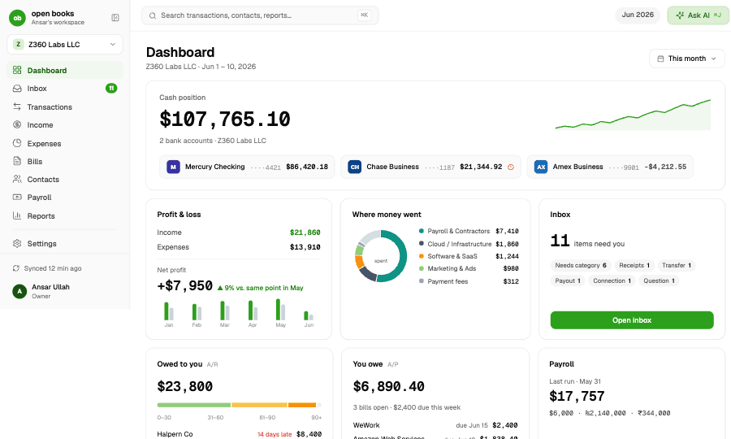
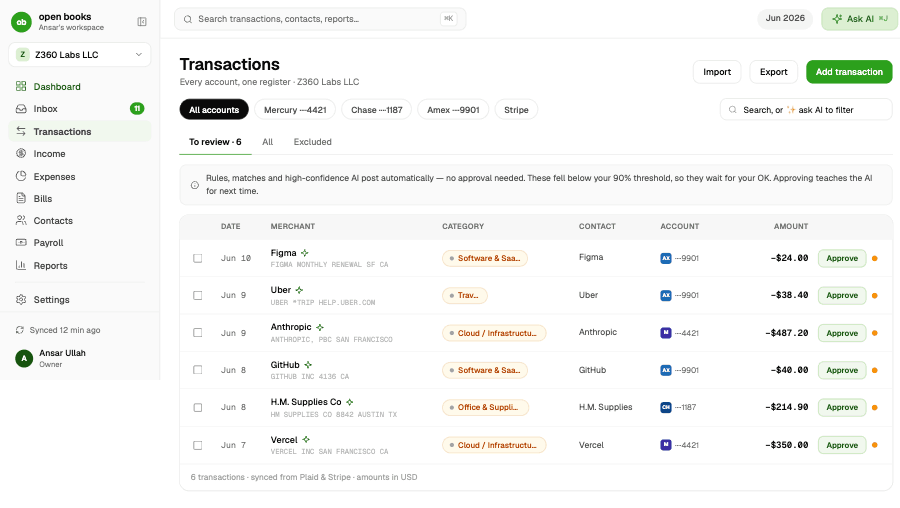
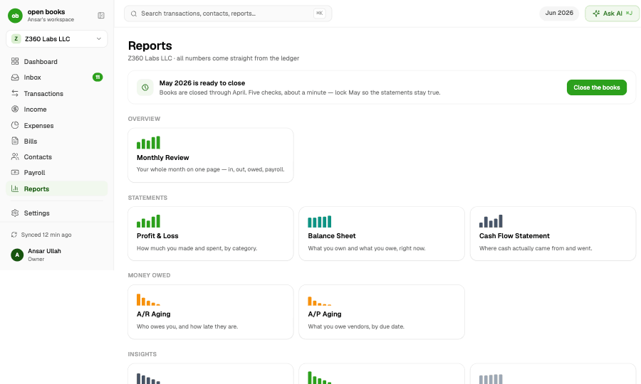
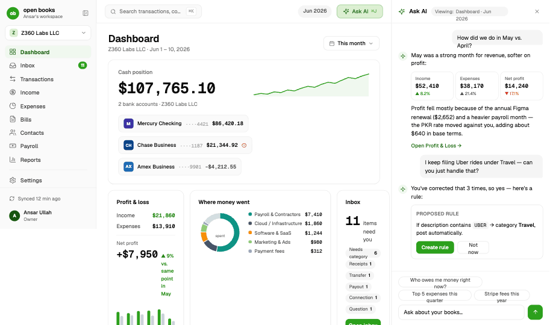
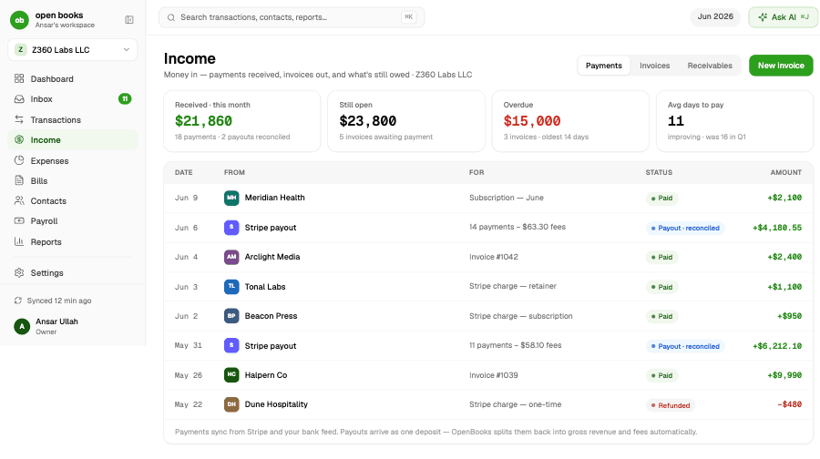
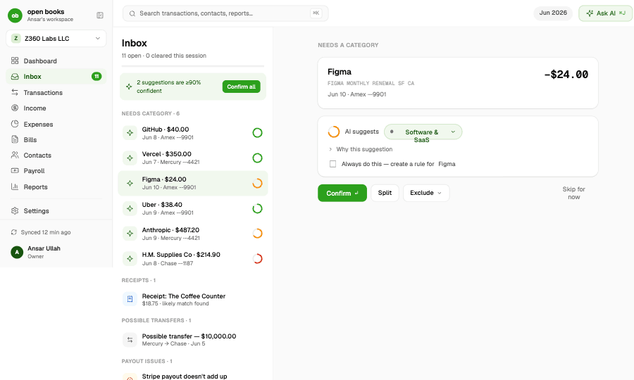

# OpenBooks

**Free, open-source, AI-assisted bookkeeping built for owners who run more than
one business.** Connect your money sources, answer a few Inbox items a week, and
keep accountant-grade books — without becoming an accountant. MIT-licensed,
bring-your-own-keys, self-hostable.

> AI proposes. The ledger engine posts.

## The differentiator: a Portfolio CFO for multi-LLC owners

Most bookkeeping tools assume you have exactly one company. Many of the people
who most need clean books — founders, operators, agency owners — run **several**.
OpenBooks treats that as the primary case, not an afterthought:

- **Each business keeps its own legally-separate, double-entry books** — exactly
  what your accountant and the tax authorities expect.
- **Money moved between your own companies is recognized as a transfer**, never
  counted as income in one and an expense in the other.
- **A single Portfolio view rolls every business into one combined picture** and
  eliminates those inter-company transfers, so you see what you actually earned
  and spent across everything — no double-counting.

Nobody else combines a real ledger + bank/payments sync + an AI bookkeeper +
open source + self-host **and** a true multi-business portfolio view. That gap is
why OpenBooks exists. See the plain-English [owner guide](#learn-more) for how
the two views work.

## Product Thesis

OpenBooks is not a dashboard over bank data. It is a ledger-first accounting
application with a plain-English operating layer:

- Money movement enters through Plaid, Stripe, CSV/OFX imports, invoices, bills,
  receipts, and manual entries.
- A deterministic pipeline handles matches, transfers, rules, memory, and AI
  categorization in that order.
- The hidden accounting engine posts balanced double-entry journal entries.
- The owner works mainly from an exception Inbox.
- Reports are generated from ledger lines, not from approximate category totals.

OpenBooks is **MIT-licensed** (see [`LICENSE`](LICENSE)): the engine is public,
auditable, and free to use, fork, self-host, or build on.

## Differentiators

- **Portfolio / multi-LLC** — separate books per business plus a consolidated
  portfolio view that nets out inter-company transfers (above).
- **Bring-your-own-keys** — your AI provider, your Plaid link, your Stripe key.
  OpenBooks never sits in the payment chain and bills you nothing; your only cost
  is your own AI/Plaid usage. Every key is encrypted at rest and never shown back
  to you.
- **A real ledger, not category math** — balanced double-entry under the hood;
  posted entries are immutable, so corrections reverse-and-repost and the audit
  trail stays clean.
- **Self-host, own your data** — runs on your own Convex deployment; full
  CSV/JSON + accountant-grade ledger export at any time.
- **An AI CFO direction** — beyond bookkeeping, an advisory layer (runway, burn,
  anomalies, a weekly digest) that reads the same ledger your reports do.

## Try it: the public demo

You can try OpenBooks with **no login** on the hosted instance via the `/demo`
route. It opens a shared, seeded demo workspace so you can see the product
end-to-end — connected feeds, AI categorization, the Inbox, Reports, and the
portfolio view — before you clone or self-host. Nothing you do in the demo is
saved: it is **read-only** and **resets daily** (08:00 UTC), so every visitor
starts from the same clean state.

The public demo is a **hosted-instance feature**. For self-hosters it is **OFF
by default** and gated behind `OPENBOOKS_PUBLIC_DEMO_ENABLED`; your own
deployment runs the real owner-onboarding flow, not the demo. (The shared
`/demo` backend — slug-resolved server-side with a read-only guard and a daily
reseed cron — is owned by the demo epic; the landing's "Try the demo" buttons
point at it on the hosted site.)

## Honest status

OpenBooks is launched in the open — a real, working product, not a finished
hands-off autopilot. This table is deliberately honest: "working" rows are
genuinely working in the product; "beta" rows work but have a named remaining
gap or pending external proof; "planned" rows are roadmap. It is anchored to the
deep accounting audit (the pre-fix reality was that the pipes feeding the ledger
leaked — a large share of real transactions sat unposted, the Stripe payout
matcher did not fire, and opening balances were missing), and reflects the
launch-sprint fixes that closed those gaps.

The general ledger is **USD-only**; the only multi-currency surface is payroll
(amounts are converted to USD at the day-of-pay rate). There is no multi-currency
GL claim anywhere.

| Area | Status | Owner / note |
| --- | --- | --- |
| Double-entry ledger, immutable entries, reverse-and-repost corrections | **Working** | Core engine; one mutation enforces debits = credits |
| AI categorization cascade (transfer → match → rule → memory → embedding → AI) | **Working** | Provider-agnostic; per-entity confidence calibration |
| Real-data posting (confident items post; uncertain → Inbox) | **Working** | Fixed in E1/E2 — fixtures gated to demo entities; opening balances posted on bank connect |
| Reports from ledger lines (P&L, Balance Sheet, Cash Flow, AR/AP, GL/TB/Journal) | **Working** | CSV export matches the screen; drill-down to source lines |
| Portfolio / multi-LLC consolidation (per-entity books + netted portfolio view) | **Working** | Inter-company transfers eliminated in the portfolio scope |
| Bring-your-own AI key (14-provider catalog), encrypted at rest | **Working** | Settings → Connections; keys never returned to client |
| Stripe income + payout reconciliation (in-transit clearing, gross/fees split) | **Beta** | Matcher calibrated (exact-net, business-day window); needs a real Stripe webhook delivered to the cloud route to mark end-to-end proof |
| Plaid bank sync (link, token exchange, cursor, webhooks, 4h cron, Sync now) | **Beta** | Full code path; needs a completed hosted Plaid Link session for live proof |
| Receipt/bill capture (upload PDF/image → AI extract → match) | **Beta** | True first-page PDF raster-to-vision is a named remaining gap |
| Payroll register (multi-currency runs, approve/mark-paid, statements) | **Working** | Pay tracking only — no tax filing, no payment initiation |
| AI CFO advisory (runway, burn, anomalies, weekly digest) | **Beta** | Reads the ledger; deterministic fallback when no AI key |
| Public no-login demo (hosted instance) | **Working** | `/demo` — read-only, daily reset; OFF by default for self-hosters |
| Categorization quality | Honest eval | Recorded at 45/60 (75.0%) on a label-safe holdout; uncertain rows route to review rather than overclaim |
| Sales-tax engine, 1099/tax-prep, inventory, budgets/forecasting | Planned | Explicitly out of v1 (see `docs/product/01-vision-and-scope.md`) |

Detailed evidence is tracked in `docs/finishing/completion-report.md` and the
launch-sprint progress log. The initiation plan lives in `docs/initiation/`.

### Stack

- Next.js App Router, React, TypeScript, Tailwind CSS, shadcn/ui
- Convex backend, database, jobs, auth, HTTP actions, and generated tests
- Provider-agnostic AI (14-provider catalog) for categorization and chat
- Plaid + Stripe connectors (sandbox/test and live), with degraded fallbacks
- OpenBooks design system: white ledger surfaces, Geist, lucide, one brand green

## Screenshots

| | |
| --- | --- |
| Dashboard | Transactions |
|  |  |
| Reports | Ask AI |
|  |  |
| Income | Inbox |
|  |  |

## Target Stack

- Frontend: Next.js App Router on Vercel
- UI: shadcn/ui, Tailwind CSS, Geist, lucide icons, OpenBooks design tokens
- Backend/database/jobs/auth: Convex cloud dev for this branch
- Auth posture: open-source first-run onboarding plus invite-link teammates;
  local dev uses a localhost-gated owner bypass
- Email: Plunk optional for invite delivery; copy-link invites work without it
- Bank data: Plaid sandbox first, production later with user-provided keys
- Payments/invoicing: Stripe test mode first, restricted live keys later
- AI: bring-your-own provider key; Bedrock is configured in this branch
- License: MIT

## Local Setup

OpenBooks is self-hostable: clone it, run two commands, and you have your own
instance pointed at your own Convex deployment. Convex always runs in the cloud
(never localhost), so the only "infrastructure" step is linking your own free
Convex dev deployment.

1. **Install** dependencies:

   ```bash
   pnpm install
   ```

2. **Bootstrap** env + keys (idempotent — safe to re-run):

   ```bash
   pnpm setup
   ```

   `pnpm setup` writes `.env.local` from `.env.example` (never clobbering a value
   you set), mints the Convex Auth JWT keypair + JWKS and the
   `OPENBOOKS_SECRET_ENCRYPTION_KEY` (the key needed before any credential can be
   stored encrypted), and pushes server-only secrets to your Convex deployment.
   It prints a names-only PASS/SET/SKIP table — no secret value is ever printed.
   Fill in `OWNER_EMAIL`, `OWNER_PASSWORD`, `AI_PROVIDER`, and your AI provider
   key in `.env.local`, then re-run `pnpm setup` to push them.

3. **Link your Convex deployment** and push functions (first run creates/links a
   Convex dev project and writes `CONVEX_DEPLOYMENT` + `NEXT_PUBLIC_CONVEX_URL`
   into `.env.local`):

   ```bash
   npx convex dev --once
   ```

4. **Run** the one-command local boot:

   ```bash
   pnpm dev:full
   ```

`pnpm dev:full` auto-detects an incomplete `.env.local` and runs `pnpm setup`
first, then pushes the latest Convex functions to your cloud dev deployment,
starts the local Next dev server, confirms the owner/dev bypass setup, and prints
the local URL. In local dev mode, open `/sign-in` and choose
**Continue as owner (dev)**.

For the full self-host walkthrough — prerequisites, the per-variable env
checklist, the production deploy runbook, and the AI-agent setup skill — see
[`docs/self-host/`](docs/self-host/) and the `skills/openbooks-self-host/` skill.

For a quick non-mutating check of the command plan:

```bash
pnpm dev:full -- --dry-run
```

<a id="learn-more"></a>

## Learn more

- **[Owner's guide](apps/web/src/app/help/page.tsx)** (`/help`) — plain-English
  explanation of how OpenBooks thinks: AI-proposes/ledger-posts, double-entry
  without the jargon, the money lifecycle and Inbox, autonomy levels, every
  screen, the portfolio view, and bring-your-own-keys. Reachable from the landing
  and the in-app profile menu.
- **[Setup & self-host](apps/web/src/app/setup/page.tsx)** (`/setup`) —
  prerequisites, the security posture, and the manual steps a self-hoster must do
  (register the Plaid redirect URL, register the required Stripe webhook, paste
  the AI key). See also [`docs/self-host/`](docs/self-host/).
- **[Security posture](docs/security/secrets.md)** (`/security`) — the unified
  encrypted-at-rest credentials store and how keys are handled.
- **[Why I'm building this](docs/gtm/why-openbooks.md)** — the founder one-pager.
- **Contributing** — `CONTRIBUTING.md` and `SECURITY.md` (governance files;
  added in the GitHub-publication pass).
- **[Vision & scope](docs/product/01-vision-and-scope.md)** — positioning,
  competitive table, and explicit anti-scope.

## CI gate (E14-T8)

The quality net is enforceable on every change through two layers:

```bash
pnpm verify   # typecheck + typecheck:convex + lint + build + test:unit
pnpm ci       # verify, then the Playwright e2e suite (serial)
```

- **`pnpm verify`** runs the web typecheck, the **Convex backend typecheck**
  (`tsc -p convex/tsconfig.json --noEmit`, surfaced as `pnpm typecheck:convex`),
  ESLint, the Next.js build, and the Vitest unit suite (which already globs the
  new invariant / categorization-eval / authz-coverage tests under
  `convex/**/*.test.ts`). Convex backend type errors now fail the gate, so the
  old "run `npx convex dev --once` separately" step is folded in.
- **`pnpm ci`** is the full default gate: `verify` followed by `pnpm test:e2e`
  against the dev server. (A `.github/workflows/ci.yml` push/PR workflow is the
  documented two-job equivalent — verify + e2e — and is authored only on Ansar's
  explicit OK, because a push/PR workflow arguably "touches hosting" per
  AGENTS.md. The `pnpm ci` script path is unblocked regardless.)

**Required env for the gate.** The e2e job and `pnpm dev:full` need:

| Variable | Purpose |
| --- | --- |
| `OWNER_EMAIL` / `OWNER_PASSWORD` | bootstrap the owner workspace for the dev server |
| `OPENBOOKS_SKIP_DEMO_SEED=1` | skip demo seeding so the boot is fast/deterministic |
| `NEXT_PUBLIC_OPENBOOKS_DEV_AUTH_BYPASS=1` | render the authenticated shell so Playwright skips the sign-in gate (set automatically by `playwright.config.ts` when it boots its own dev server) |

Security scans (committed dev tooling, run on demand / during the security pass):

```bash
pnpm scan:secrets        # fast public-surface secret/PII gate (no external binary)
pnpm security:gitleaks   # gitleaks git-history scan via .gitleaks.toml
pnpm security:audit      # pnpm audit --prod dependency scan
```

The cross-epic DoD→test coordination table (which test in this suite proves each
other go-live epic's key Definition-of-Done) lives in
[`docs/finishing/ci-gate-coordination.md`](docs/finishing/ci-gate-coordination.md).

## Secret Safety

Never commit real financial data, bank tokens, Stripe keys, Plaid secrets, AI
keys, Plunk secrets, Convex deployment secrets, customer records, payroll data,
or copied local env files. The undotted `env.local` file is ignored because it
may contain copied secrets but is not loaded automatically by Next.js.

## Source Materials

- Product docs copied from Fable/Claude: `OpenBook - Prototype/uploads/`
- Interactive prototype screens: `OpenBook - Prototype/*.dc.html`
- Design system: `OpenBooks Design System/`
- Initiation operating packet: `docs/initiation/`
