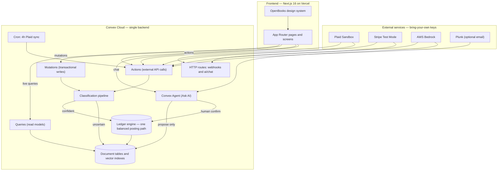
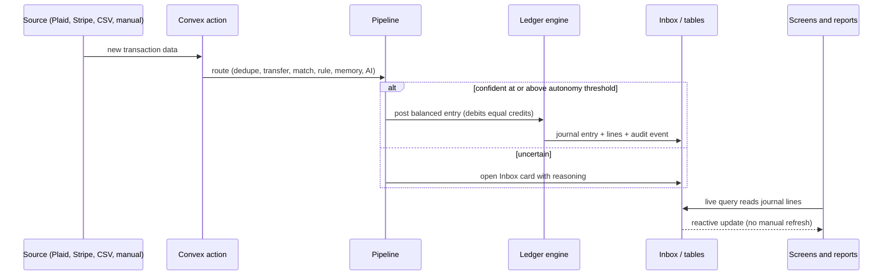
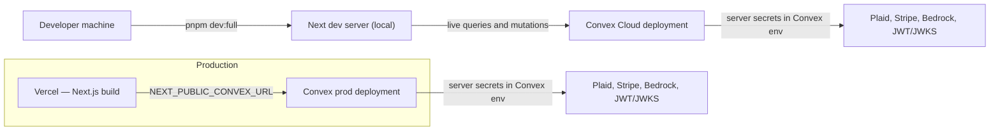

# OpenBooks — System Architecture

> A reference for technical reviewers. It explains what the system is, how it is
> structured, how data flows, how it is deployed, and where the risks are.
> Companion documents: [`flow.md`](../flow.md) (one-page conceptual flow),
> [`docs/product/02-product-spec.md`](product/02-product-spec.md) (product spec
> and data-model intent), and [`docs/ui-audit-report.html`](ui-audit-report.html)
> (the current product/UI audit). Claims here are grounded in the code on the
> `finishing` branch.

---

## 1. Purpose

OpenBooks is a free, open-source, AI-assisted **double-entry bookkeeping**
application for small businesses — a self-hostable QuickBooks alternative. The
owner works in plain English (income, expenses, categories, an Inbox); the
system keeps a hidden, balanced ledger underneath.

The governing rule is **"AI proposes, the ledger engine posts."** AI and rules
may *suggest* postings; only one mutation may *write* the ledger, and it rejects
anything that does not balance. This makes the output accountant-grade and every
AI mistake reversible.

The mandatory loop:

1. Money data enters (Plaid, Stripe, CSV/OFX, invoices, bills, receipts, payroll,
   manual entry).
2. A deterministic pipeline attempts transfer / match / rule / memory / AI
   classification.
3. Confident items post through one balanced ledger mutation.
4. Uncertain items go to the Inbox for the owner.
5. Reports query journal lines, never ad-hoc category totals.

---

## 2. Stack at a glance

| Layer | Choice |
|---|---|
| Frontend | Next.js 16 (App Router), React 19, TypeScript, Tailwind v4, shadcn/ui + Radix, `cmdk`, `react-plaid-link` |
| Design | OpenBooks design system — one brand green `#2ca01c`, Geist + Geist Mono, lucide icons, tabular money figures |
| Backend | Convex (queries, mutations, actions, HTTP routes, crons, vector indexes) — runs in a **cloud** dev deployment, never locally |
| AI | AWS Bedrock via the Vercel AI SDK and `@convex-dev/agent` (Claude / Nova / Moonshot Kimi / Titan embeddings) |
| Auth | `@convex-dev/auth` password provider; JWT/JWKS |
| Integrations | Plaid (sandbox-locked), Stripe (test-mode-locked), Plunk (optional email) |
| Packaging | pnpm workspaces (`apps/web`, `packages/email`); deploy on Vercel (frontend) + Convex (backend) |
| License | AGPL-3.0-only |

---

## 3. Repository layout

| Path | Contents |
|---|---|
| `apps/web/` | The Next.js app — App Router pages, `components/openbooks/*` screens, `components/ui/*` shadcn primitives, `lib/openbooks/*` client helpers |
| `convex/` | The entire backend (~29k LOC) — schema, ledger, pipeline, integrations, AI, domain modules, HTTP routes, crons, tests |
| `packages/email/` | Email package (Plunk integration helpers) |
| `scripts/` | `dev-full.mjs` (one-command boot), `preflight.mjs`, `seed-demo.mjs`, eval scripts, Stripe webhook registration |
| `docs/` | Product, initiation, finishing, deployment, and security documentation |
| `OpenBooks Design System/` | Brand tokens, fonts, icons, component kit, full screen recreations |
| `tests/` | Vitest unit harness entry + Playwright e2e specs (`tests/e2e/`) |

---

## 4. System architecture

The defining property: **the ledger engine is the only writer of journal
entries**, and reads (reports, dashboard, AI answers) all derive from those
journal lines. The AI never writes the ledger directly.

---

## 5. Major modules (backend services)

All live in `convex/`. Grouped by domain.

| Domain | Modules | Responsibility |
|---|---|---|
| Ledger core | `ledger.ts`, `money.ts` | `postLedgerEntryCore` — the single balanced posting path; integer-minor money; period locks; reversals |
| Pipeline | `pipeline.ts` | The nine-stage classification cascade; routes confident items to the ledger, uncertain to the Inbox |
| Read models | `coreViews.ts`, `reportViews.ts`, `moduleViews.ts`, `incomeViews.ts`, `expensesViews.ts`, `reports.ts` | Dashboard, register, Inbox, and all reports — computed from journal lines |
| AR / AP | `invoices.ts`, `bills.ts`, `categories.ts`, `rules.ts` | Invoice draft/finalize/void, bill create/settle, chart-of-accounts and rules |
| Payroll | `payroll.ts`, `payrollMath.ts` | Run lifecycle, multi-currency settlement, FX gain/loss |
| Receipts | `receipts.ts` | Upload, Bedrock vision extraction, embedding match, create-expense |
| AI | `agent.ts`, `agentTools.ts`, `agentToolQueries.ts`, `aiThreads.ts`, `bedrockCategorizer.ts`, `semanticMemory.ts`, `ai.ts`, `proposals.ts`, `aiProviderRegistry.ts` | The Ask AI agent, the categorizer, vector memory, propose-and-confirm |
| Integrations | `plaid.ts`, `plaidWebhook.ts`, `stripe.ts`, `stripeWebhook.ts`, `http.ts`, `crons.ts` | Bank and payment sync, webhooks, the sync cron |
| Identity | `auth.ts`, `authz.ts`, `authAdmin.ts`, `session.ts`, `onboarding.ts`, `entities.ts`, `profile.ts`, `team.ts`, `settings.ts`, `systemActors.ts` | Auth, authorization, onboarding, multi-tenancy, roles, the system sync actor |
| Schema / seed | `schema.ts`, `seedDemo.ts` | Table definitions and indexes; deterministic demo data |

---

## 6. Frontend architecture

- **Routing.** App Router with a catch-all `app/[section]/page.tsx` that maps a
  URL section to a screen via `lib/openbooks/content.ts`, wrapped in `AppShell`.
  Settings is owned by dedicated `app/settings/[section]` routes. Other dedicated
  routes: `/ask-ai`, `/profile`, `/sign-in`, `/invite/[token]`.
- **Screens.** `components/openbooks/*` — `CoreScreens` (Dashboard, Inbox,
  Transactions), `IncomeScreen`, `ExpensesScreen`, `ModuleScreens` (Bills,
  Contacts, Payroll), `ReportsScreen`, `OpenBooksAIChat`, `SettingsScreen` plus
  ten `settings/*` sections, `OnboardingScreen`, `ProfileScreen`,
  `CommandPalette`.
- **Data wiring.** Screens read live Convex queries (`useQuery(api.coreViews.*)`,
  `api.reportViews.reportPack`, etc.) and call real mutations/actions. There is
  no mock business data in any live screen; legacy static arrays in `content.ts`
  are unreferenced.
- **Ask AI surfaces.** One `OpenBooksAIChat` component rendered three ways: a
  docked desktop column, a mobile bottom sheet, and the full `/ask-ai` page.
- **Design system.** White surfaces, hairline borders, one brand green, Geist
  fonts, lucide icons, tabular money figures, no gradients or emoji. Sidebar
  232px, content max 1200px.
- **Known finish gaps.** Dashboard charts are hand-rolled div/SVG primitives
  (no charting library, no donut, first-word category labels); some accent-color
  drift beyond the single green; `ModuleScreens.tsx` mixes live and dead code.

---

## 7. Backend / services architecture

- **One posting path.** `ledger.postLedgerEntryCore` is the only function that
  inserts `journalEntries`/`journalLines`. It enforces at least two lines, a
  debit-xor-credit per line, equal debit and credit totals, an unlocked period,
  and same-entity accounts, then writes the entry `locked: true` plus an audit
  event. Corrections never edit in place — they post a reversing entry and a new
  entry.
- **Actions vs mutations.** External API calls (Plaid, Stripe, Bedrock) run in
  Convex **actions**; transactional writes run in **mutations**. Actions
  authorize by calling an authed query first, then write through mutations.
- **The pipeline** receives already-computed AI/semantic proposals as arguments
  and is the transactional router; the network-bound assembly lives in the
  `bedrockCategorizer` action.
- **The agent.** `@convex-dev/agent` provides durable threads and streaming.
  Five read tools (report, balances, transactions, contacts, payroll) and five
  propose tools (categorize, rule, invoice draft, bill, journal entry). Propose
  tools only write a `proposals` row; posting happens exclusively through a
  human-confirmed `confirmProposal` that routes to the ledger.

---

## 8. Data model (essentials)

Every business table is **entity- or workspace-scoped with a matching index** —
the basis of tenant isolation. The "categories" the owner sees *are* ledger
accounts.

- **Ledger:** `ledgerAccounts`, `journalEntries` (immutable, `locked`,
  `reversesEntryId`), `journalLines` (debit/credit minor + currency),
  `periodLocks`.
- **Operational:** `transactions`, `inboxItems`, `invoices`, `bills`, `contacts`,
  `employees`, `payrollRuns`, `payrollRunLines` (FX micro-units).
- **AI / memory:** `rules`, `aiConfigs`, `aiCorrectionMemories`,
  `aiMemoryEmbeddings` (vector), `proposals`, `aiEvalRuns`, `aiBatchRuns`.
- **Integrations:** `bankAccounts`, `plaidItems` (`environment` pinned to
  `sandbox`), `stripeAccounts`, `stripePayouts`, `stripePayoutLines`,
  `stripeWebhookEvents`.
- **Documents:** `documents`, `receiptEmbeddings`, `receiptTransactionEmbeddings`.
- **Identity / system:** `workspaces`, `workspaceSettings`, `workspaceMembers`,
  `userProfiles`, `invites` (token hash only), `onboardingChecklists`,
  `entities`, `auditEvents`, `systemActors`, `chatThreads`.

Money is integer minor units everywhere; FX rates are integer micro-units.

---

## 9. Data flow — a synced transaction

The same path serves Plaid sync, Stripe sync, CSV import, receipts, and manual
entry. Duplicates are suppressed by external id; pending-to-posted transitions
carry the category forward; removed bank transactions post a reversing entry.

---

## 10. Integrations

| Integration | How it works | Status |
|---|---|---|
| Plaid | Link token, public-token exchange (token stored server-side, never sent to the client), cursor-based `/transactions/sync`, removal reversal, 4-hour cron, JWT-verified webhook, manual Sync now. Hard-locked to the Plaid sandbox. | Code complete and unit-tested with a mocked network; **a real hosted Link session has not run**. |
| Stripe | Signature-verified webhook, event dedupe, live-key refusal, targeted single-object sync, clearing-account payout reconciliation, payout-line drill-down. Test-mode only. | Code complete and unit-tested; **no real Stripe-originated webhook delivered** (the registration script self-signs its payload). |
| AWS Bedrock | Categorizer and Ask AI agent via the AI SDK; Titan embeddings for memory; graceful degraded mode without keys. | Working in code; live behaviour depends on AWS keys and Bedrock model access. |
| Plunk | Optional invite/notification email; copy-link fallback when absent. | Optional, unconfigured. |

Keys are read from the Convex deployment environment only — there is no UI to
enter Plaid/Stripe/AI keys yet.

---

## 11. Deployment architecture

- **Cloud Convex only.** `scripts/dev-full.mjs` refuses a localhost Convex URL;
  the Next app runs locally *against* a cloud Convex deployment. There is no
  documented "bring your own Convex project" path yet.
- **Secret strategy.** All third-party calls run in Convex actions, so server
  secrets live in the Convex deployment environment; Vercel receives only
  frontend-safe `NEXT_PUBLIC_*` values. Both `.env.local` and `env.local` are
  gitignored; no secrets are committed.
- **One-command boot.** `pnpm dev:full` pushes functions to the cloud, bootstraps
  the owner from `OWNER_EMAIL`/`OWNER_PASSWORD`, starts the dev server and Convex
  watcher, and seeds demo data. A localhost-gated dev-auth bypass provides the
  "Continue as local dev owner" sign-in.

---

## 12. Authentication, authorization, and multi-tenancy

- **Auth:** Convex Auth password provider; open self-serve sign-up (each new
  account lands in its own fresh tenant). Owner bootstrap is idempotent.
- **Model:** workspace -> members (owner/admin/member) -> entities (businesses).
  The active entity is client-selected but server-revalidated against the
  caller's workspace.
- **Enforcement:** authorization is server-authoritative on every UI-reachable
  path — it is always re-derived from the entity's own `workspaceId`. Roles are
  enforced on privileged mutations; UI hiding is secondary.
- **Background actor:** a per-workspace `system:sync` actor attributes background
  postings and cannot be spoofed from a public call (no public function accepts
  an actor id).
- **Known gap:** the legacy `aiChatRuntime.answer` action and its `POST /ai/chat`
  route authorize the workspace but pass a client-supplied `entityId` unchecked
  into the AI read tools — a cross-tenant read. See risks below.

---

## 13. Background jobs and webhooks

- **Cron:** one — a 4-hour Plaid sync (`crons.ts`).
- **Webhooks (Convex HTTP):** `/plaid/webhook` (ES256 JWT + body-hash verified),
  `/stripe/webhook` (HMAC + timestamp tolerance + dedupe, test-mode only),
  `/ai/chat` (the legacy Ask-AI route).
- **Scheduler:** Plaid sync schedules an AI categorization batch; proposals
  auto-expire.

---

## 14. Risks and technical debt

| Area | Risk | Severity |
|---|---|---|
| Tenant isolation | `POST /ai/chat` reads another tenant's data from a client-supplied `entityId` (bounded; not used by the product UI). One-line fix. | Critical |
| Money rails | Plaid and Stripe are coded and unit-tested but unproven against real external sessions. | High |
| AI quality | Honest holdout categorization accuracy is 75%, below the 80% target (safe — uncertain rows go to the Inbox). | High |
| Self-host | No bring-your-own-Convex path; the boot script bans localhost Convex. | High |
| Payroll FX | The multi-currency settlement and FX gain/loss path has no automated test. | Medium |
| Ledger balancing | The balance check sums across currencies without conversion (latent; all callers use one currency per entry today). | Medium |
| Operations | No metrics/tracing/alerting; no automated backups (export exists). | Medium |
| Code hygiene | `ModuleScreens.tsx` mixes live and dead code; a legacy keyword answerer and a circular eval remain in the tree. | Low |

---

## 15. Recommended improvements

1. **Close the tenant-isolation gap** — validate `entityId` against the workspace
   in `getEntityById` (also hardens the durable-agent path).
2. **Prove the money rails** — run a hosted Plaid sandbox Link session and deliver
   a real Stripe test webhook; then mark those rows verified.
3. **Lift AI categorization** toward the 80% target, or make the Inbox handoff
   explicit in product copy.
4. **Add a bring-your-own-Convex setup guide** and a portable deploy path; add a
   UI to enter Plaid/Stripe/AI keys.
5. **Test the payroll FX path** and make ledger balancing currency-aware.
6. **Add observability and automated backups** before production reliance.
7. **A dashboard charting pass** (donut, full labels, axes, normalized grid) and a
   cleanup of dead code.

For the full severity-rated finding set and an implementation roadmap, see
[`docs/ui-audit-report.html`](ui-audit-report.html).
