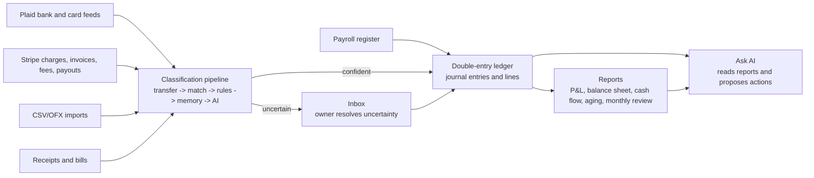
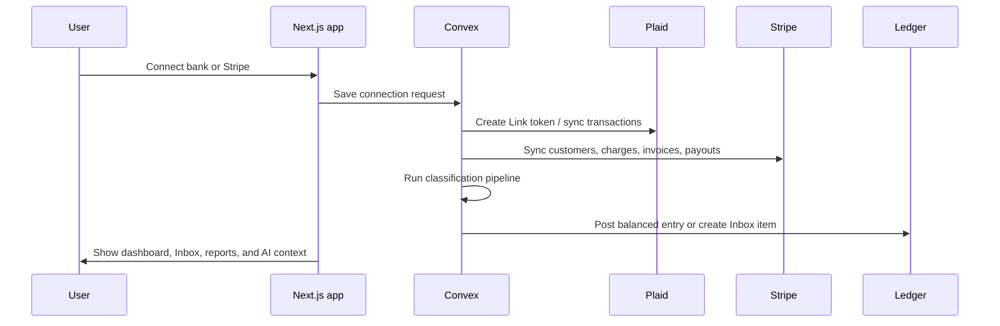

# OpenBooks Flow

This file describes the product and system flow at the level a founder,
designer, or implementation agent should understand before touching code.

## Conceptual Flow

## Owner Workflow

1. The owner connects a business, bank accounts, Stripe, and optional AI key.
2. OpenBooks syncs or imports transaction data.
3. The system posts high-confidence items automatically only when the configured
   autonomy threshold allows it.
4. Anything uncertain becomes an Inbox card with context, reasoning, and a clear
   primary action.
5. The owner clears the Inbox weekly.
6. Reports, dashboard widgets, and AI answers update from the same ledger truth.

## Trust Boundary

The UI may say "Software expense" or "Stripe payout." The ledger stores the
actual accounting truth:

- Every posted entry has at least two lines.
- Debits and credits must balance.
- Posted entries are not edited in place.
- Re-categorization creates a reversal plus a new entry.
- AI and rules can propose postings, but only the ledger engine can post them.

## Integration Flow

## Release Flow

1. Local baseline passes `pnpm typecheck`, `pnpm lint`, and `pnpm build`.
2. Convex dev deployment is linked and has required env vars.
3. Vercel project is linked and receives only frontend-safe public env vars.
4. Server-only secrets live in Convex env or Vercel env by runtime need.
5. `openbooks.ansarullahanas.com` points to the Vercel production deployment.
6. Public sign-up stays disabled; invited users and contact-form leads are the
   only allowed entry paths.
